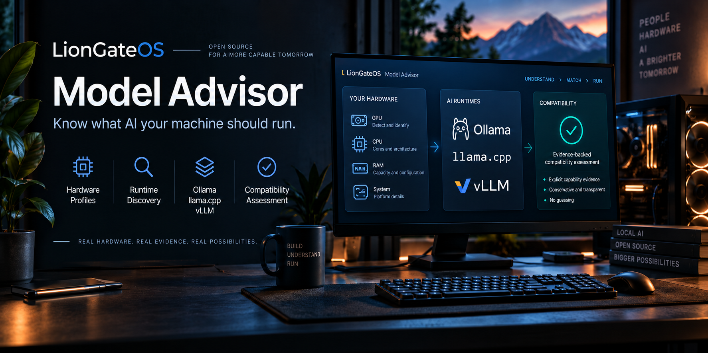

  

# LionGateOS Model Advisor

> **Know what AI your machine should run.**

LionGateOS Model Advisor is an open-source project for helping people determine which AI models are actually worth running on their hardware, for the work they want to do.

The goal is to reduce wasted time downloading, configuring, and testing models that are a poor fit for a machine or workload.

## Project Status

Model Advisor is in early public development.

The first implemented capability is a normalized hardware profile.

Current capabilities include:

- automatic Linux detection of operating system, CPU, system RAM, and PCI graphics devices;
- NVIDIA GPU enrichment through `nvidia-smi` when available, including model, VRAM, and driver version;
- basic vendor and device identification from PCI information;
- manual hardware entry when automatic discovery is unavailable or unwanted;
- read-only discovery of Ollama, llama.cpp, and vLLM;
- conservative hardware/runtime compatibility assessment from explicit runtime capability evidence;
- local read-only web dashboard for hardware, runtime, compatibility, reasons, and evidence;
- normalized JSON output;
- graceful handling of unavailable optional discovery tools and unknown values.

Current limitations:

- automatic hardware discovery is currently Linux-focused;
- AMD and Intel GPU enrichment beyond PCI information is not yet implemented;
- runtime discovery currently covers Ollama, llama.cpp, and vLLM;
- hardware/runtime compatibility currently depends on explicit positive capability evidence and may remain unknown when evidence is unavailable;
- model compatibility and recommendation logic are not yet implemented;
- benchmark execution and comparison are not yet implemented.

Planned areas include:

- broader NVIDIA, AMD, Intel, Apple Silicon, and CPU support;
- broader local AI runtime discovery and runtime metadata;
- model and runtime compatibility information;
- VRAM, RAM, storage, and offload estimates;
- quantization recommendations;
- task-specific model recommendations;
- reproducible model benchmarks;
- benchmark comparison and history;
- clear explanations for non-expert users;
- themes, accessibility, and translations.

The project does **not** provide automatic model installation, automatic model downloading, autonomous execution, or unattended AI orchestration.

## Try the Hardware Profile

From the repository root:

    PYTHONPATH=src python3 -m liongateos_model_advisor

For manual hardware entry:

    PYTHONPATH=src python3 -m liongateos_model_advisor --manual

The output is a normalized JSON hardware profile. Unknown values remain unknown rather than being guessed.

## Discover Local AI Runtimes

Model Advisor can detect supported AI runtimes without starting them:

    PYTHONPATH=src python3 -m liongateos_model_advisor runtimes

Current runtime discovery includes:

- Ollama from the system `PATH`;
- vLLM from the system `PATH`;
- llama.cpp tools such as `llama-cli` and `llama-server` from `PATH`;
- explicitly supplied llama.cpp directories or executables.

For a custom llama.cpp installation:

    PYTHONPATH=src python3 -m liongateos_model_advisor runtimes --runtime-path /path/to/llama.cpp/bin

Absolute custom filesystem paths are used only for discovery and are not included in the normalized public runtime profile.

Runtime discovery reports installation availability and metadata such as versions and supported executable names. It does **not** start services or claim that an installed runtime is currently running.

## Check Hardware/Runtime Compatibility

Model Advisor can combine detected hardware, installed runtimes, and read-only runtime capability evidence:

    PYTHONPATH=src python3 -m liongateos_model_advisor compatibility

For a custom llama.cpp installation:

    PYTHONPATH=src python3 -m liongateos_model_advisor compatibility --runtime-path /path/to/llama.cpp/bin

Compatibility results distinguish:

- `compatible` — positive runtime capability evidence matches detected hardware;
- `incompatible` — reserved for cases where incompatibility is actually proven;
- `unknown` — there is not enough evidence to make a safe compatibility claim;
- `unavailable` — the runtime was not discovered.

Current positive evidence sources include:

- llama.cpp device reporting through `--list-devices`;
- vLLM environment reporting through `collect-env`;
- observed Ollama GPU execution through `ollama ps`.

Missing or failed capability probes do **not** automatically mean incompatible. Model Advisor keeps those results unknown rather than guessing.

This compatibility layer evaluates detected hardware against runtime capability evidence. It does **not** yet determine whether a particular model will fit, perform well, or be recommended for the machine.

## Open the Local Dashboard

Model Advisor includes a local read-only dashboard that presents the same verified hardware, runtime discovery, and compatibility information in a browser:

    PYTHONPATH=src python3 -m liongateos_model_advisor dashboard

Then open:

    http://127.0.0.1:8765/

The dashboard binds to the local loopback interface by default. It does not provide shell access, model installation, downloads, job dispatch, approval controls, or arbitrary filesystem access.

For a custom llama.cpp installation:

    PYTHONPATH=src python3 -m liongateos_model_advisor dashboard --runtime-path /path/to/llama.cpp/bin

The dashboard shows compatibility conclusions alongside their reasons and evidence. The same conservative evidence rules apply as in the command-line compatibility output: missing evidence remains unknown rather than being treated as incompatibility.

The dashboard currently presents implemented hardware, runtime, and compatibility capabilities only. Model-fit recommendations, quantization guidance, benchmark results, confidence scoring, and concurrency estimates are not yet implemented.

## Contributing

Community contributions are welcome.

Useful contribution areas will include:

- NVIDIA, AMD, Intel, Apple Silicon, and CPU hardware support;
- Ollama, llama.cpp, vLLM, and other runtime adapters;
- model metadata and compatibility data;
- quantization guidance;
- benchmark definitions and validators;
- recommendation heuristics;
- UI and accessibility;
- themes and translations;
- documentation.

See [CONTRIBUTING.md](CONTRIBUTING.md) before starting a substantial change.

## License

Licensed under the [Apache License 2.0](LICENSE).
